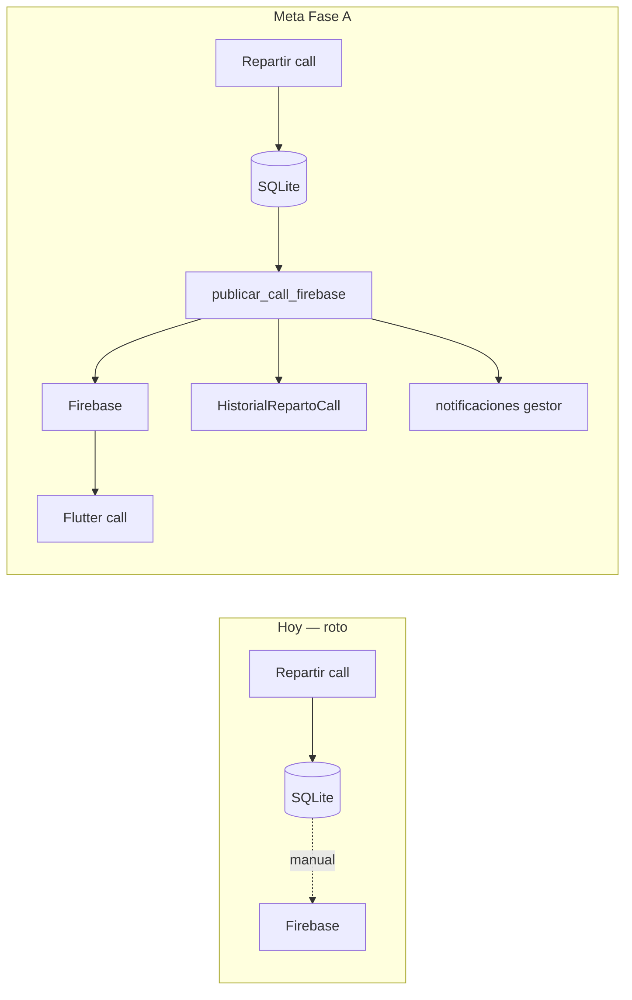

# Plan de mejora del flujo operativo — AntCobranzas

**Fecha:** 16/06/2026 (`160626`)  
**Alcance inmediato:** puntos 1–4 (Fase A)  
**Alcance diferido:** puntos 5–8 (Fase B)  
**Apps:** `admin-app` (Python) + `flutter-app` (APK)  
**Contexto:** empresa de cobranzas con call center (tramo 1) y gestores de campo (tramos 2–3).

---

## Respuesta: reparto call center y Firebase (punto 6 del análisis previo)

### ¿Se sube a Firebase automáticamente hoy?

**No.** El flujo actual es:

1. `distribute_call_center()` → `distribute_tramo1()` en `call_center_service.py` actualiza **solo SQLite** (`call_gestor_uid`, `call_gestor_nombre`).
2. La UI muestra explícitamente: *"Distribuya a Firebase para publicar la cartera call"* (`call_center.py` línea ~585, `team.py` línea ~1237).
3. El operador debe ir a Campaña / acción global **Subir a Firebase** (`app.py` → `_on_upload`) para publicar.

### ¿Les llega la cartera a los trabajadores de call center?

**Solo si alguien sube manualmente después del reparto.**

- En Firestore, cada gestor call tiene sección virtual `_CALL_{uid}` (creada al dar de alta el usuario con `canal: call` en `firebase_service.create_gestor_user`).
- `get_firebase_payload()` coloca clientes en fase call bajo esa sección cuando tienen `call_gestor_uid` asignado (`campaign_manager.py` ~1609–1618).
- La APK Flutter filtra cartera por `profile.secciones`, que incluye `_CALL_{uid}` para gestores call (`user_model.dart` → `isCallGestor`).
- **Si no hay upload tras el reparto**, el gestor call sigue viendo la cartera anterior (o vacía).

### Reasignación manual

`reassign_call_client()` en `call_center_service.py` también **solo actualiza SQLite**; no mueve el documento en Firestore ni notifica al gestor.

### Resumen de brecha

| Acción | SQLite | Firestore | Notificación gestor | Historial auditable |
|--------|--------|-----------|---------------------|---------------------|
| Repartir tramo 1 | ✅ | ❌ manual | ❌ | ❌ |
| Re-equilibrar todo | ✅ | ❌ manual | ❌ | ❌ |
| Reasignar cliente call | ✅ | ❌ | ❌ (existe `notify_gestor_client_reassigned` pero no se invoca) | ❌ |

**Conclusión:** el reparto debe publicarse a Firebase de forma **automática** y quedar **registrado con motivo** (ver Fase A, punto 2).

---

## Decisión de producto: DNI en Firebase

**Política acordada (16/06/2026):** el DNI (`numero_documento`) **sí debe incluirse** en la subida a Firestore.

- El código ya lo hace: `get_firebase_payload()` usa `include_sensitive=True`.
- La documentación y algunos mensajes de UI están **desactualizados** y dicen lo contrario.

**Cambios de documentación (punto 4):**

| Archivo | Cambio |
|---------|--------|
| `electron-app-docs/01_VISION_GENERAL.md` | Actualizar criterios de datos sensibles: DNI sí en Firestore para operación call/campo |
| `.cursor/skills/antcobranzas-sync/SKILL.md` | Tabla Data boundary: Firestore incluye DNI |
| `admin-app/ui/app.py` | Diálogo `_on_upload`: quitar *"DNI NO se enviarán"* |
| `admin-app/services/firebase_service.py` | Docstring `upload_cartera_filtered`: corregir *"no DNI"* |
| `AGENTS.md` | Opcional: una línea aclarando política DNI |

No cambiar `include_sensitive` en código; solo alinear docs y mensajes.

---

## Fase A — Implementar ahora (puntos 1–4)

### Objetivo global

Cerrar el circuito **Excel → reparto call → Firebase → APK call** sin pasos olvidados, con visibilidad del estado de la campaña y trazabilidad de repartos.



---

### Punto 1 — Wizard / asistente de publicación de campaña

**Problema:** 7+ pasos manuales encadenados sin guía; fácil omitir upload o evaluación de tramos.

**Solución:** panel **"Publicar campaña"** (wizard de 5 pasos) accesible desde Inicio y Campaña.

#### Pasos del wizard

| # | Paso | Acción automática / guiada | Precondición |
|---|------|--------------------------|--------------|
| 1 | Verificar datos | Mostrar resumen Excel/campaña activa | `active_campaign` |
| 2 | Evaluar tramos | Botón ejecuta `TramoEngine.evaluate` si hay cambios pendientes | SQLite |
| 3 | Equipo listo | Check: gestores call activos ≥ 1, gestores campo con secciones | Firebase `usuarios` |
| 4 | Reparto call (tramo 1) | Vista previa LPT + ejecutar + **auto-publicar** (punto 2) | Paso 3 OK |
| 5 | Subir cartera completa | `get_firebase_payload` + `upload_cartera_filtered` + notificaciones | Firebase conectado |

Cada paso muestra: ✅ completado | ⚠️ pendiente | ❌ bloqueado (con texto de por qué).

#### Archivos a crear / modificar

| Archivo | Cambio |
|---------|--------|
| `admin-app/ui/components/campaign_wizard.py` | **NUEVO** — widget wizard reutilizable (pasos, estado, acciones) |
| `admin-app/ui/pages/dashboard.py` | Botón "Asistente de campaña" en `_render_overview` |
| `admin-app/ui/pages/campaign.py` | Misma entrada al wizard; reutilizar lógica existente de tramos/upload |
| `admin-app/services/campaign_manager.py` | `get_campaign_readiness()` → dict con flags de cada paso |
| `admin-app/ui/app.py` | Opcional: menú o atajo; exponer `campaign_mgr` al wizard |

#### API sugerida

```python
# campaign_manager.py
def get_campaign_readiness(self, campana_id, *, gestores_firestore, firebase_connected) -> dict:
    """
    Returns:
        steps: [{ id, label, status, detail, action_key }]
        blockers: [str]
        can_publish: bool
    """
```

---

### Punto 2 — Upload automático tras reparto call + historial + notificaciones

**Problema:** reparto y reasignación solo en SQLite; gestores call no reciben clientes hasta upload manual.

**Solución:** tras cada reparto/re-equilibrio/reasignación call exitosa, publicar automáticamente las secciones `_CALL_*` afectadas, registrar historial y notificar gestores.

#### 2.1 Nuevo modelo de historial

| Archivo | Cambio |
|---------|--------|
| `admin-app/services/database.py` | **NUEVA tabla** `HistorialRepartoCall` (migración schema v16) |

Campos propuestos:

```python
class HistorialRepartoCall(Base):
    __tablename__ = "historial_reparto_call"
    id: int PK
    campana_id: str
    fecha: datetime
    tipo: str          # reparto_inicial | reequilibrio | reasignacion_manual
    motivo: str        # texto legible para UI
    algoritmo: str     # LPT | manual
    admin_uid: str
    admin_nombre: str
    cuentas_afectadas: int
    monto_afectado: float
    detalle_json: Text # lista de cambios
    firebase_ok: bool
    firebase_error: Text | null
```

Estructura `detalle_json` (por cliente):

```json
{
  "cambios": [
    {
      "codigo_cliente": "12345",
      "nombre": "...",
      "importe": 1500.0,
      "gestor_anterior_uid": "",
      "gestor_anterior_nombre": "",
      "gestor_nuevo_uid": "abc",
      "gestor_nuevo_nombre": "María López",
      "razon": "LPT: menor monto acumulado entre gestores call"
    }
  ],
  "resumen_gestores": [
    { "uid": "abc", "nombre": "...", "cuentas_antes": 10, "cuentas_despues": 15, "monto_despues": 45000 }
  ]
}
```

#### 2.2 Extender resultado del reparto

| Archivo | Cambio |
|---------|--------|
| `admin-app/services/call_center_service.py` | Nuevo dataclass `CallAssignmentChange`; `DistributionResult.cambios: list` |
| `call_center_service.distribute_tramo1` | Antes de commit, capturar `call_gestor_uid` anterior por cliente; al asignar, append a `result.cambios` con `razon` según modo |
| `call_center_service.reassign_call_client` | Devolver `(ok, msg, change: CallAssignmentChange \| None)` |

**Textos de `razon`:**

| `tipo` | `motivo` (cabecera historial) | `razon` (por cliente) |
|--------|-------------------------------|------------------------|
| `reparto_inicial` | Reparto automático tramo 1 — cuentas sin asignar | Algoritmo LPT: asignación al gestor call con menor monto acumulado |
| `reequilibrio` | Re-equilibrio total de cartera call tramo 1 | Re-equilibrio LPT: redistribución para equilibrar montos entre operadores |
| `reasignacion_manual` | Reasignación manual por supervisor | Reasignación manual a {nombre destino} |

#### 2.3 Publicación Firebase parcial (solo secciones call afectadas)

| Archivo | Cambio |
|---------|--------|
| `admin-app/services/campaign_manager.py` | **NUEVO** `publish_call_distribution(campana_id, cambios, *, firebase_service, meta)` |
| `campaign_manager.py` | **NUEVO** `build_call_sections_payload(campana_id, section_keys: set[str])` — filtra `get_firebase_payload` |
| `firebase_service.py` | **NUEVO** `upload_cartera_sections(by_seccion, campaign_id, section_keys)` o parámetro `only_sections` en upload existente |
| `firebase_service.py` | **NUEVO** `notify_call_repartition(destinatarios, resumen, detalles, campaign_id)` — tipo `reparto_call` en colección `notificaciones` |

Flujo `publish_call_distribution`:

1. Calcular `section_keys` = `{_CALL_{uid} for uid in gestores tocados}`.
2. Para clientes **salientes** de un gestor (reequilibrio): mover/eliminar doc en Firestore sección anterior (`update_client_zone` o delete si ya no pertenece).
3. Subir/actualizar docs en sección destino (`upload_cartera` por sección, preservando visitas).
4. Escribir `HistorialRepartoCall`.
5. `notify_call_repartition` → cada gestor call afectado recibe notificación en APK (`notifications_screen.dart` ya lee `notificaciones`).
6. `SyncLog` con `tipo=call_distribution_upload`.

#### 2.4 Integrar en UI

| Archivo | Cambio |
|---------|--------|
| `admin-app/ui/pages/call_center.py` | `_on_distributed`: tras reparto, llamar `publish_call_distribution` en hilo; quitar mensaje *"Distribuya a Firebase"*; mostrar resumen con enlace a historial |
| `admin-app/ui/pages/team.py` | Igual en `_on_call_distributed` |
| `admin-app/ui/pages/call_center.py` | **NUEVA sección** "Historial de repartos" — tabla últimos N eventos + botón ver detalle (JSON parseado a filas) |
| `admin-app/services/campaign_manager.py` | `distribute_call_center(..., firebase_service=None, auto_publish=True)` — si Firebase conectado, publicar al final |

#### 2.5 Reasignación manual

| Archivo | Cambio |
|---------|--------|
| `call_center.py` (UI) | Tras `reassign_call_client` OK → `publish_call_distribution` con un solo cambio |
| `firebase_service.py` | Reutilizar `notify_gestor_client_reassigned` **o** unificar en `notify_call_repartition` |

#### 2.6 Flutter (solo lectura de notificaciones — cambio mínimo)

| Archivo | Cambio |
|---------|--------|
| `flutter-app/lib/models/notification_model.dart` | Añadir tipo `reparto_call` si hace falta etiqueta UI |
| `flutter-app/lib/screens/notifications_screen.dart` | Mostrar título/mensaje del reparto; opcional: contador de cuentas nuevas |

No requiere rebuild APK obligatorio si el payload es genérico (`titulo`, `mensaje`, `detalles`); verificar tras implementar.

#### 2.7 Tests

| Archivo | Cambio |
|---------|--------|
| `admin-app/test_call_distribution.py` | **NUEVO** — LPT, historial, payload `_CALL_*` |
| `admin-app/test_validation.py` | Migración v16 |

---

### Punto 3 — Checklist de estado en Inicio

**Problema:** el supervisor no ve de un vistazo qué falta para cerrar el ciclo.

**Solución:** tarjeta **"Estado de la campaña"** en `dashboard.py` → `_render_overview`.

#### Indicadores (semáforo)

| Indicador | Fuente | OK cuando |
|-----------|--------|-----------|
| Excel cargado | `active_campaign` | Existe campaña activa |
| Firebase conectado | `app.firebase_connected` | `True` |
| Cartera publicada | `SyncLog` último `tipo=upload` o metadata Firestore | Upload exitoso en últimas 24h o tras carga |
| Tramos evaluados | `HistorialTramo` / flag en `campaign_mgr` | Sin clientes con tramo desactualizado |
| Call repartido | `HistorialRepartoCall` o `sin_asignar == 0` | Cero cuentas tramo1 call sin gestor |
| Call publicado en Firebase | Último historial `firebase_ok=True` | Tras punto 2 |
| Última sync visitas | `SyncLog` `tipo=visits_only` | Fecha + registros |
| Pendiente export banco | heurística día ciclo ≥ 55 o manual | Badge informativo |

| Archivo | Cambio |
|---------|--------|
| `admin-app/ui/pages/dashboard.py` | `_render_campaign_status_card()` |
| `admin-app/services/campaign_manager.py` | `get_operational_status(campana_id) -> dict` — alimenta checklist y wizard |
| `admin-app/ui/theme.py` | Colores semáforo si no existen (`SUCCESS`, `WARNING`, `DANGER`) |

---

### Punto 4 — Alinear documentación y mensajes DNI

Ver tabla en sección **Decisión de producto: DNI en Firebase**. Solo docs y strings UI; **no** cambiar lógica de payload.

---

## Fase B — Planificado para después (puntos 5–8)

No implementar en esta iteración; dejar referenciado para el siguiente agente.

| # | Mejora | Resumen de implementación futura |
|---|--------|----------------------------------|
| 5 | Sync visible en APK | Indicador conectividad + cola Firestore; badge "pendientes de subir" en `home_shell.dart` |
| 6 | Tiempo real en dashboard Flutter | Activar `streamClients` en `dashboard_screen.dart` o polling 30s |
| 7 | Menú GPS en admin | Añadir `("tracking", "📍", "GPS")` a `NAV_ITEMS` en `app.py` |
| 8 | Unificar UI Call Center | Eliminar tab duplicado en `team.py`; enlace "Ir a Call Center" |

---

## Orden de implementación recomendado (Fase A)

Para otro agente, seguir este orden para minimizar conflictos:

1. **Punto 4** — Docs y mensajes DNI (rápido, sin riesgo).
2. **Punto 2.1–2.3** — Modelo historial + `publish_call_distribution` + notificaciones (backend).
3. **Punto 2.4–2.5** — UI call center + auto-publish + panel historial.
4. **Punto 3** — `get_operational_status` + checklist Inicio.
5. **Punto 1** — Wizard que consume `get_campaign_readiness` y `get_operational_status`.
6. Tests + smoke manual (flujo abajo).

---

## Criterios de aceptación (Fase A)

- [ ] Tras "Repartir tramo 1" con Firebase conectado, los gestores call ven nuevas cuentas en APK **sin** upload manual adicional.
- [ ] Tras "Re-equilibrar todo", documentos Firestore reflejan nueva asignación; gestores desasignados dejan de ver cuentas movidas.
- [ ] Reasignación manual sincroniza Firestore y notifica al gestor destino.
- [ ] Cada reparto genera fila en `historial_reparto_call` con motivo, resumen por gestor y detalle de cambios.
- [ ] Panel Call Center muestra últimos repartos y permite ver detalle.
- [ ] Inicio muestra checklist con semáforos actualizados.
- [ ] Wizard guía pasos 1–5 y marca bloqueos.
- [ ] Documentación y diálogo upload dicen que **DNI sí se incluye** en Firebase.
- [ ] `test_call_distribution.py` pasa; migración v16 aplicada en DB vacía y existente.

---

## Smoke test manual

1. Cargar Excel de prueba con cuentas tramo 1.
2. Crear 2 gestores `canal=call` en Equipo.
3. Call Center → Vista previa → Repartir tramo 1.
4. Verificar: mensaje de éxito con "Publicado en Firebase"; historial con motivo LPT.
5. Login APK gestor call A → ver cuentas asignadas.
6. Reasignar un cliente a gestor call B → B lo ve; A ya no.
7. Inicio → checklist en verde para call publicado.
8. Wizard → todos los pasos verdes o con siguiente acción clara.

---

## Archivos tocados — resumen

### Nuevos

- `admin-app/ui/campaign_wizard.py`
- `admin-app/test_call_distribution.py`
- `admin-app/docs/PLAN-FLUJO-TRABAJO-160626.md` (este archivo)

### Modificados (Fase A) — ✅ implementado 16/06/2026

- `admin-app/services/database.py` — tabla + migración v16
- `admin-app/services/call_center_service.py` — cambios, razones, historial en resultado
- `admin-app/services/campaign_manager.py` — publish, readiness, operational status
- `admin-app/services/firebase_service.py` — upload parcial, notify reparto, docstrings
- `admin-app/ui/pages/call_center.py` — auto-publish, historial UI
- `admin-app/ui/pages/team.py` — auto-publish (o delegar solo a call_center)
- `admin-app/ui/pages/dashboard.py` — checklist + entrada wizard
- `admin-app/ui/pages/campaign.py` — entrada wizard
- `admin-app/ui/app.py` — mensaje DNI upload
- `electron-app-docs/01_VISION_GENERAL.md`
- `.cursor/skills/antcobranzas-sync/SKILL.md`
- `flutter-app/lib/models/notification_model.dart` (opcional)
- `flutter-app/lib/screens/notifications_screen.dart` (opcional)

### Fase B (pendiente)

- `flutter-app/lib/screens/home_shell.dart`
- `flutter-app/lib/screens/dashboard_screen.dart`
- `flutter-app/lib/services/firestore_service.dart`
- `admin-app/ui/app.py` — NAV tracking
- `admin-app/ui/pages/team.py` — quitar duplicado call

---

## Referencias de código actuales

| Tema | Ubicación |
|------|-----------|
| Reparto LPT | `admin-app/services/call_center_service.py` → `distribute_tramo1` |
| Mensaje "Distribuya a Firebase" | `admin-app/ui/pages/call_center.py` ~581–585 |
| Payload Firebase con `_CALL_` | `admin-app/services/campaign_manager.py` → `get_firebase_payload` |
| Upload global | `admin-app/ui/app.py` → `_on_upload` |
| Gestor call en Flutter | `flutter-app/lib/models/user_model.dart` → `isCallGestor` |
| Notificaciones gestor | `firebase_service.py` → colección `notificaciones` |
| Sync log existente | `admin-app/services/database.py` → `SyncLog` |

---

## Notas para el agente implementador

- Leer skills: `antcobranzas-admin-app`, `antcobranzas-sync`, `firebase-expert` antes de editar.
- No tocar `electron-app`.
- Tras cambios en `flutter-app/`, ejecutar `flutter build apk --release` (regla `flutter-apk-build.mdc`).
- Preservar visitas existentes en upload parcial (reutilizar `_read_existing_visit_data` de `firebase_service.py`).
- En re-equilibrio, clientes que cambian de `_CALL_A` a `_CALL_B` requieren **mover** documento, no solo reescribir SQLite.
- Mantener compatibilidad con `cartera_activa` como ID Firestore fijo.

---

*Documento generado el 16/06/2026 para continuidad entre sesiones de agente.*
