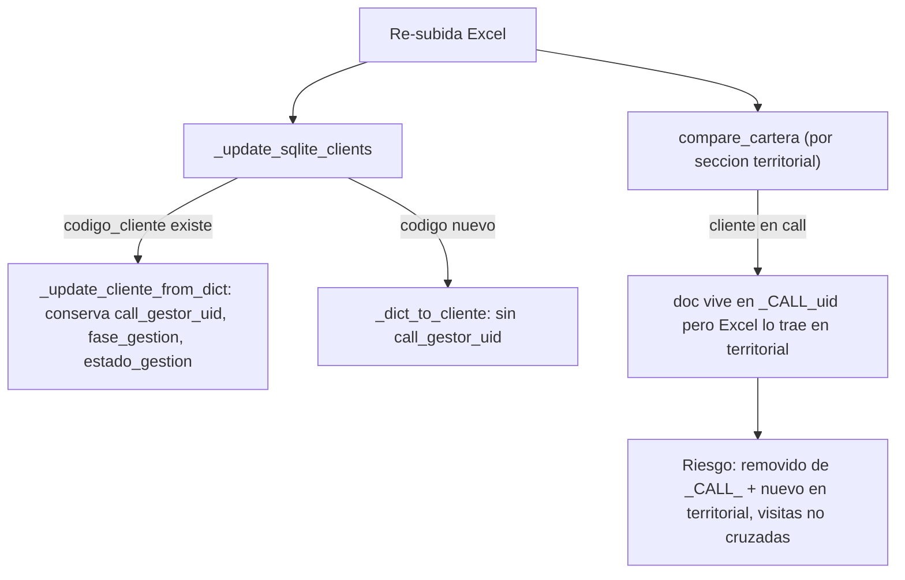
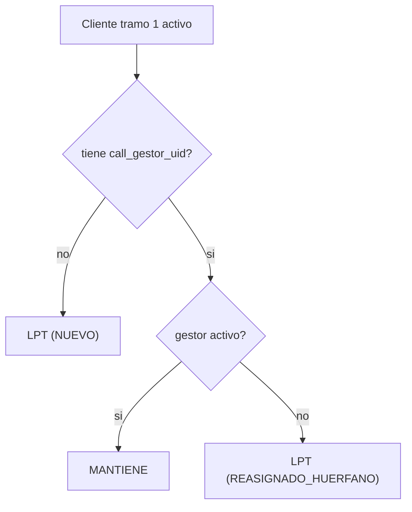
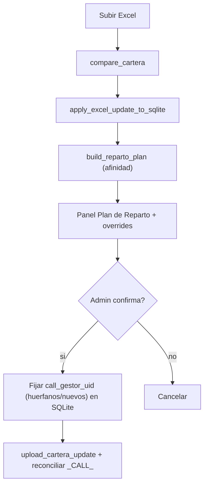

# Plan — Panel de Plan de Reparto con preservación de afinidad cliente-asesor

## Objetivo

Garantizar que, al **re-subir el Excel del banco**, los clientes que reaparecen caigan al **mismo gestor de campo** y al **mismo asesor de call center** que ya tenían (afinidad), y ofrecer un **panel previo** donde el admin vea y ajuste el reparto (quién recibe qué cliente) **antes de publicar** a Firestore.

---

## 1. Diagnóstico (estado actual)

Dos canales con lógica distinta:

- **Campo (territorial):** el cliente cae a un gestor por su `seccion_key` = `region_zona_seccion`, que viene en el Excel. La sección se mapea a un gestor vía `usuarios.secciones` en Firestore. La afinidad es **implícita**: se mantiene mientras el Excel no cambie región/zona/sección del cliente.
  - `make_seccion_key` en [admin-app/services/excel_parser.py](admin-app/services/excel_parser.py) (L46-55).
  - Índice sección -> gestor en `_build_section_assignment_index` de [admin-app/services/campaign_manager.py](admin-app/services/campaign_manager.py) (L4637+).

- **Call center:** algoritmo **LPT** (greedy por monto) sobre cuentas tramo 1 en [admin-app/services/call_center_service.py](admin-app/services/call_center_service.py). Persiste `call_gestor_uid` en SQLite; el documento Firestore vive en la sección virtual `_CALL_{uid}`.
  - `distribute_tramo1` (L282-360), `simulate_distribution` (L249-279), `get_effective_firestore_section` (L119-126).

### Qué se preserva hoy y qué no



- **SQLite:** la afinidad **ya se preserva** porque los clientes se indexan por `codigo_cliente` y `_update_cliente_from_dict` ([admin-app/services/campaign_manager.py](admin-app/services/campaign_manager.py) L778+) solo pisa datos bancarios. El archivado es *soft-delete* (`activo_en_cartera=False`), la fila nunca se borra.
- **Reparto call inicial:** `distribute_tramo1(only_unassigned=True)` solo toca cuentas **sin** `call_gestor_uid`, por lo que no rompe afinidad existente.

### Huecos a resolver

1. **Desincronización Firestore `_CALL_` vs territorial.** El diff ([admin-app/services/diff_engine.py](admin-app/services/diff_engine.py)) compara Excel (territorial) contra Firestore (territorial + `_CALL_{uid}`). La preservación de visitas (`_read_existing_visit_data` + `prev` en [admin-app/services/firebase_service.py](admin-app/services/firebase_service.py)) opera por sección del diff y **no cruza** `_CALL_` <-> territorial.
2. **Asesor call inactivo:** cliente que vuelve con `call_gestor_uid` apuntando a un gestor dado de baja queda huérfano; `only_unassigned=True` no lo re-reparte.
3. **Clientes nuevos** (código nuevo) tramo 1 llegan sin `call_gestor_uid`.
4. **Cambio de sección por el banco:** el cliente cae a otro gestor de campo en silencio.
5. **Cero visibilidad previa:** no hay panel que muestre el mapeo final cliente -> asesor antes de publicar. Hoy solo existen el resumen de diff en `_show_update_summary` ([admin-app/ui/app.py](admin-app/ui/app.py) L786+) y la simulación de call aislada en [admin-app/ui/pages/call_center.py](admin-app/ui/pages/call_center.py).

---

## 2. Reglas de afinidad (definición funcional)

Por cada cliente **activo** tras aplicar el Excel:

### Campo

- `seccion_key_nueva` = `make_seccion_key(region, zona, seccion)` del Excel.
- Si el cliente ya existía y `seccion_key_anterior != seccion_key_nueva` -> estado `AFINIDAD_ROTA_CAMPO` (informativo; el banco mandó el cambio). Override opcional: respetar gestor anterior moviendo la sección, pero por defecto se respeta el Excel.

### Call (solo tramo 1 / `fase_gestion == call`)

Prioridad de asignación:

1. **MANTIENE** — tiene `call_gestor_uid` y ese gestor sigue **activo** -> conservar.
2. **REASIGNADO_HUERFANO** — tenía `call_gestor_uid` pero el gestor está **inactivo/eliminado** -> reasignar por LPT.
3. **NUEVO** — cliente nuevo o sin uid -> asignar por LPT.

El balanceo LPT solo se aplica a los clientes de los grupos 2 y 3; los de grupo 1 entran como carga fija (se suman a `monto_total` del gestor para que el LPT equilibre el resto correctamente).



---

## 3. Arquitectura propuesta

### 3.1 Nuevo servicio: `services/reparto_planner.py`

Construye un **plan de reparto** sin persistir, reutilizando lo existente.

Estructuras (dataclasses):

```python
@dataclass
class ClienteReparto:
    codigo_cliente: str
    nombre: str
    seccion_key: str            # territorial (Excel)
    gestor_campo_uid: str       # desde indice usuarios.secciones
    gestor_campo_nombre: str
    fase_gestion: str           # call | campo
    call_gestor_uid: str        # asignacion final propuesta
    call_gestor_nombre: str
    estado_afinidad: str        # MANTIENE | NUEVO | REASIGNADO_HUERFANO | AFINIDAD_ROTA_CAMPO | SIN_GESTOR_CAMPO
    importe: float

@dataclass
class RepartoPlan:
    campana_id: str
    clientes: list[ClienteReparto]
    resumen_campo: dict          # seccion_key -> {gestor, n, monto, mantiene, rotos}
    resumen_call: list[GestorCallBalance]
    sin_gestor_campo: list[str]  # secciones sin gestor en usuarios.secciones
    conflictos_campo: list[str]  # secciones con >1 gestor (del indice existente)
    overrides: dict              # codigo_cliente -> call_gestor_uid (ajustes manuales)
```

Función principal:

```python
def build_reparto_plan(
    session, campana_id, gestores_firestore, *, overrides=None
) -> RepartoPlan: ...
```

Pasos internos:
1. Cargar clientes activos de SQLite.
2. Indexar gestores de campo por sección (reutilizar `_build_section_assignment_index`).
3. Filtrar gestores call activos (`filter_call_gestores`).
4. Clasificar cada cliente tramo 1 con las reglas de afinidad y correr LPT solo sobre no-fijados (extender `simulate_distribution` para aceptar "carga fija inicial" por gestor).
5. Aplicar `overrides` manuales encima.
6. Agregar resúmenes.

### 3.2 Nueva página UI: `ui/pages/reparto.py`

Registrar en `NAV_ITEMS` ([admin-app/ui/app.py](admin-app/ui/app.py) L36-50) un ítem `("reparto", "🧭", "Plan de Reparto")` y su feature en `_PAGE_FEATURE` (`"monitor"` o `"users"`).

Contenido (siguiendo patrones de [admin-app/ui/pages/call_center.py](admin-app/ui/pages/call_center.py) y `team.py`):
- **KPIs**: clientes totales, % que mantiene afinidad, nuevos, reasignados, secciones sin gestor.
- **Resumen por gestor** (campo y call): nº clientes, deuda, mantiene / nuevo / reasignado.
- **Tabla por cliente** (Treeview con paginación como en `campaign.py`): código, nombre, sección, gestor campo, asesor call, **badge de estado de afinidad**.
- **Override manual**: reasignar un cliente a otro asesor call antes de confirmar (escribe en `plan.overrides` y recalcula).
- Botón **"Confirmar y publicar"**.

### 3.3 Integración en el flujo

Insertar el panel **entre el diff y la publicación**, tanto en la primera distribución (`_on_upload`, [admin-app/ui/app.py](admin-app/ui/app.py) L641+) como en la actualización (`_on_update_base` / `_show_update_summary`, L744+).



### 3.4 Persistencia y publicación al confirmar

1. Para clientes `NUEVO` y `REASIGNADO_HUERFANO`, escribir `call_gestor_uid`/`call_gestor_nombre` en SQLite (equivalente a `distribute_tramo1` pero respetando el plan/overrides). Registrar `HistorialRepartoCall`.
2. Subir cartera con `upload_cartera_update` (ya corregido a `set(merge=True)`).
3. **Reconciliar `_CALL_`**: tras el update, re-publicar las secciones `_CALL_*` afectadas desde SQLite reutilizando `publish_call_distribution` / `build_call_sections_payload` / `upload_cartera_sections` ([admin-app/services/campaign_manager.py](admin-app/services/campaign_manager.py) L1040+, L1120+), de modo que el doc territorial "nuevo" y el `_CALL_` queden consistentes y conserven `estado_gestion`/visitas.

---

## 4. Fases de implementación

### Fase 1 — Servicio de planificación (sin UI)
- Crear [admin-app/services/reparto_planner.py](admin-app/services/reparto_planner.py) con `ClienteReparto`, `RepartoPlan`, `build_reparto_plan`.
- Extender `simulate_distribution` en [admin-app/services/call_center_service.py](admin-app/services/call_center_service.py) para aceptar carga fija inicial por gestor (clientes que MANTIENEN).
- Detección de gestor inactivo (huérfano) usando `filter_call_gestores` + lista de `usuarios`.
- Tests unitarios en `admin-app/tests/test_reparto_planner.py` (afinidad: mantiene / nuevo / huérfano / sección cambiada).

### Fase 2 — Panel UI de solo lectura
- Crear [admin-app/ui/pages/reparto.py](admin-app/ui/pages/reparto.py) y registrar en `NAV_ITEMS` y `_PAGE_FEATURE`.
- Render de KPIs, resumen por gestor y tabla por cliente con badges.
- Entrega visibilidad inmediata sin tocar la publicación.

### Fase 3 — Overrides + confirmación e integración al flujo
- Override manual de asesor call por fila (recalcula plan).
- Enganchar el panel como paso previo en `_on_update_base` (reemplaza el salto directo `_show_update_summary` -> `upload_work`) y en `_on_upload`.
- Al confirmar: fijar `call_gestor_uid` de nuevos/huérfanos en SQLite + historial.

### Fase 4 — Reconciliación Firestore y casos límite
- Reconciliar secciones `_CALL_*` tras `upload_cartera_update`.
- Cruce de visitas `_CALL_` <-> territorial al cambiar de fase.
- Manejo de conflictos de sección (>1 gestor) y secciones sin gestor (avisos en panel).

---

## 5. Casos límite

- **Gestor call eliminado** entre cargas -> huérfanos reasignados por LPT (Fase 1).
- **Cliente pasó a tramo 2** (call -> campo) entre cargas: `evaluate_tramos` ya lo mueve; el plan debe respetar la fase resultante.
- **Sección sin gestor de campo** asignado -> badge `SIN_GESTOR_CAMPO`, no bloquea pero avisa.
- **Conflicto de sección** (>1 gestor reclama la misma) -> ya detectado por `_build_section_assignment_index`; mostrar en panel.
- **Cliente archivado que reaparece** -> conserva `call_gestor_uid`; si el gestor sigue activo, MANTIENE.

---

## 6. Pruebas (UAT)

Extender [admin-app/docs/UAT-ACTUALIZACION-EXCEL.md](admin-app/docs/UAT-ACTUALIZACION-EXCEL.md):
- Excel A: cliente tramo 1 asignado a asesor call X.
- Excel B: mismo cliente reaparece -> el panel debe mostrar `MANTIENE` con asesor X.
- Desactivar asesor X y re-subir -> `REASIGNADO_HUERFANO` a otro asesor por LPT.
- Verificar en Firestore que el doc `_CALL_` final es consistente (sin duplicado territorial activo, visitas conservadas).

---

## 7. Archivos afectados (resumen)

- Nuevo: `admin-app/services/reparto_planner.py`
- Nuevo: `admin-app/ui/pages/reparto.py`
- Nuevo: `admin-app/tests/test_reparto_planner.py`
- Editar: `admin-app/services/call_center_service.py` (carga fija en `simulate_distribution`)
- Editar: `admin-app/ui/app.py` (`NAV_ITEMS`, `_PAGE_FEATURE`, integración en `_on_update_base` / `_on_upload`)
- Editar: `admin-app/services/campaign_manager.py` (orquestación: fijar reparto del plan + reconciliación `_CALL_`)
- Editar: `admin-app/services/firebase_service.py` (cruce de visitas `_CALL_` <-> territorial en `upload_cartera_update`)
- Editar: `admin-app/docs/UAT-ACTUALIZACION-EXCEL.md`

> Tras cambios en `admin-app`, recompilar el EXE con `pyinstaller --clean AntCobranzas.spec` desde el venv (regla del proyecto).
